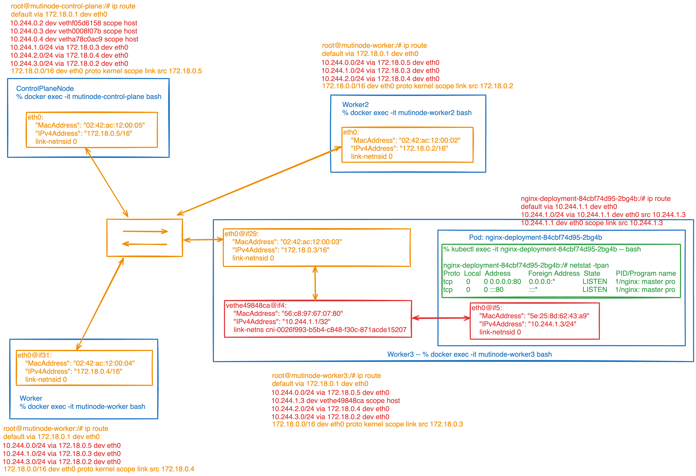

# Multi-Nodes Network



## Creation
```
% kind create cluster --config ./config.yaml --name mutinode 
Creating cluster "mutinode" ...
 ✓ Ensuring node image (kindest/node:v1.35.0) 🖼 
 ✓ Preparing nodes 📦 📦 📦 📦  
 ✓ Writing configuration 📜 
 ✓ Starting control-plane 🕹️ 
 ✓ Installing CNI 🔌 
 ✓ Installing StorageClass 💾 
 ✓ Joining worker nodes 🚜 
Set kubectl context to "kind-mutinode"

% kubectl cluster-info --context kind-mutinode
Kubernetes control plane is running at https://127.0.0.1:55588
CoreDNS is running at https://127.0.0.1:55588/api/v1/namespaces/kube-system/services/kube-dns:dns/proxy

Thanks for using kind! 😊
```

## Nodes:

```
% docker ps --no-trunc             
CONTAINER ID                                                       IMAGE                                                                                          COMMAND                                  CREATED              STATUS          PORTS                       NAMES
548b4118d40d7ef6f5903acf8d10658bea36e17283e5268a223917e7a1fe0a85   kindest/node:v1.35.0@sha256:452d707d4862f52530247495d180205e029056831160e22870e37e3f6c1ac31f   "/usr/local/bin/entrypoint /sbin/init"   About a minute ago   Up 58 seconds                               mutinode-worker2
5d211b396f07d97f3c7ed6a61c004fbab1fdff82a49d95d71f45a1e7670a3631   kindest/node:v1.35.0@sha256:452d707d4862f52530247495d180205e029056831160e22870e37e3f6c1ac31f   "/usr/local/bin/entrypoint /sbin/init"   About a minute ago   Up 58 seconds                               mutinode-worker3
e1b411e8aa231a547c100908915d66cec5eeb823bb39a8e91d0288f8c4ce5b57   kindest/node:v1.35.0@sha256:452d707d4862f52530247495d180205e029056831160e22870e37e3f6c1ac31f   "/usr/local/bin/entrypoint /sbin/init"   About a minute ago   Up 58 seconds                               mutinode-worker
23752c79b2fa8df3a319acc83e21ef12e965288481ec6100c69983900ac52f7b   kindest/node:v1.35.0@sha256:452d707d4862f52530247495d180205e029056831160e22870e37e3f6c1ac31f   "/usr/local/bin/entrypoint /sbin/init"   About a minute ago   Up 58 seconds   127.0.0.1:55588->6443/tcp   mutinode-control-plane
```

## Customized container
```
% kind load docker-image nginx-with-ip:latest --name mutinode 
Image: "nginx-with-ip:latest" with ID "sha256:52a2acb466fc5f3dd525502bf497117712d8d4dc539742ed5d45ace6015c9f8e" not yet present on node "mutinode-worker2", loading...
Image: "nginx-with-ip:latest" with ID "sha256:52a2acb466fc5f3dd525502bf497117712d8d4dc539742ed5d45ace6015c9f8e" not yet present on node "mutinode-worker3", loading...
Image: "nginx-with-ip:latest" with ID "sha256:52a2acb466fc5f3dd525502bf497117712d8d4dc539742ed5d45ace6015c9f8e" not yet present on node "mutinode-worker", loading...
Image: "nginx-with-ip:latest" with ID "sha256:52a2acb466fc5f3dd525502bf497117712d8d4dc539742ed5d45ace6015c9f8e" not yet present on node "mutinode-control-plane", loading...

% kubectl --context kind-mutinode apply -f /Users/i519210/SAPDevelop/mengxi-personal/learning-notes/k8s/kind/multi-nodes/deploy-app/nginx-deployment.yaml
deployment.apps/nginx-deployment created
service/nginx-service created
```
