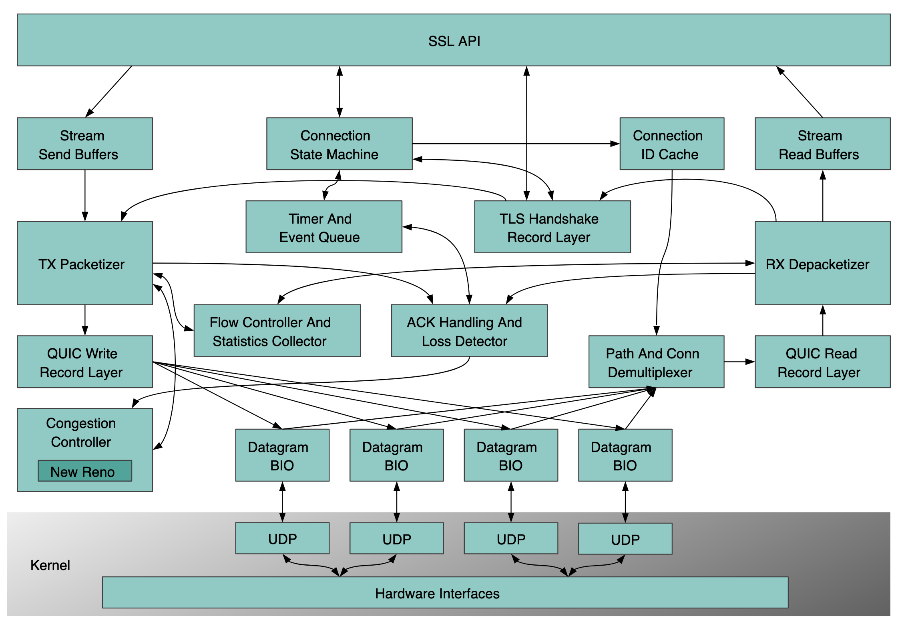

# Reading openssl/doc

## Architecture Overview

The diagram below is for QUIC protocol but I will use it as a reference for me to understand the TLS one, which is more popular for now.

Reference: https://github.com/openssl/openssl/blob/master/doc/designs/quic-design/quic-overview.md



<br/>

## DDD (Demo-Driven Design)

### Blocking connection with SSL context
Refer: https://github.com/openssl/openssl/blob/master/doc/designs/ddd/ddd-01-conn-blocking.c

- The SSL context structure is mapped to `ssl_ctx_st` at `include/openssl/types.h`
    ```
    typedef struct ssl_ctx_st SSL_CTX;
    ```
- `ssl_ctx_st` has a 373-line definition at `ssl/ssl_local.h`, which contains everything

<br/>

TODO: to build and gdb the example, so the first step is to follow: https://github.com/openssl/openssl/blob/master/NOTES-UNIX.md 

